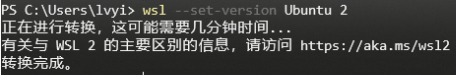

# Windows10启动WSL2

1. 管理员权限启动PowerShell
2. 输入以下命令启用虚拟机平台
    ``` powershell
    Enable-WindowsOptionalFeature -Online -FeatureName VirtualMachinePlatform
    ```
3. 输入以下命令启动Linux子系统功能
    ``` powershell
    Enable-WindowsOptionalFeature -Online -FeatureName Microsoft-Windows-Subsystem-Linux
    ```
4. 通过Windows Store安装一个Linux发行版，例如Ubuntu，下载后记得还要安装
5. 下载Linux内核更新包：https://docs.microsoft.com/zh-cn/windows/wsl/install-manual#step-4---download-the-linux-kernel-update-package
6. 使用以下指令检查是否安装成功
    ``` powershell
    wsl -l
    ```
7. 使用以下指令将发行版设为WSL2
    ``` powershell
    wsl --set-version Ubuntu 2
    ```
8. 出现下图时为正确情况
    
9. 如果BIOS没开虚拟机功能的话需要去开启一下


### 参考地址
- http://blog.itpub.net/26736162/viewspace-2677779/
- https://segmentfault.com/a/1190000040143442
- https://docs.microsoft.com/zh-cn/windows/wsl/install-manual
- https://docs.microsoft.com/zh-cn/windows/wsl/install
