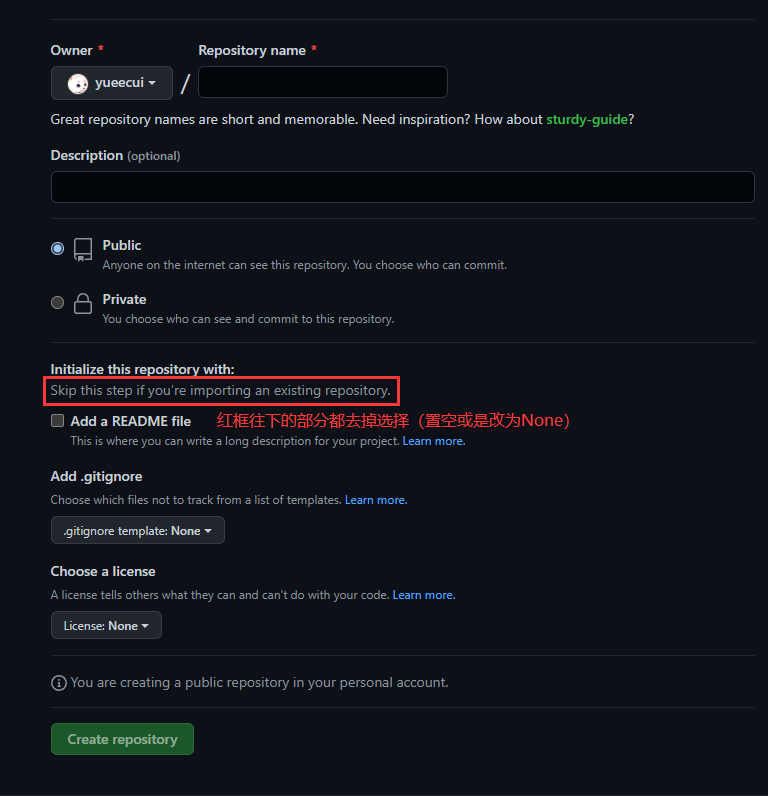
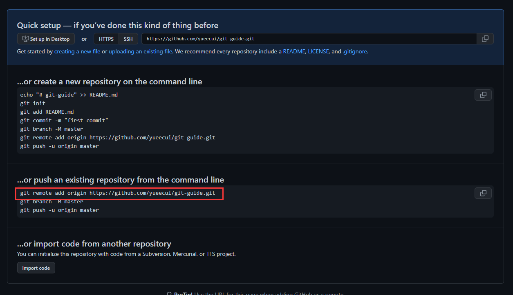
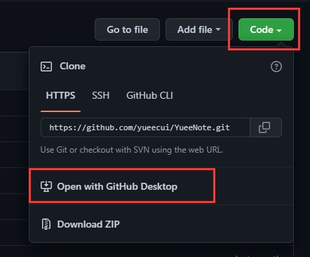
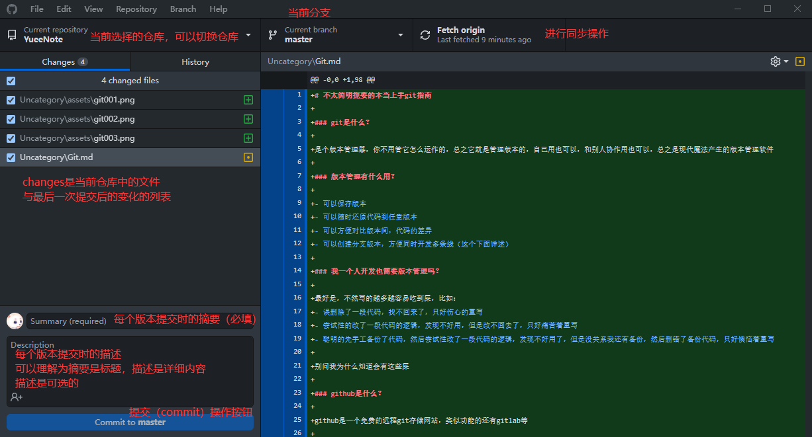
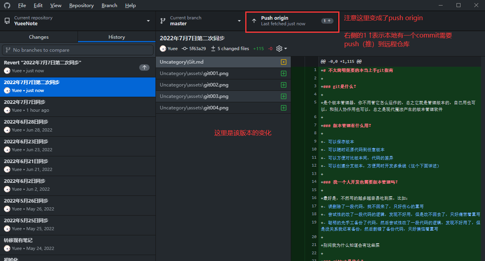

# 不太简明扼要的本当上手git指南

## git是什么？

是个版本管理器，你不用管它怎么运作的，总之它就是管理版本的，自己用也可以，和别人协作用也可以，总之是现代魔法产生的版本管理软件

## 版本管理有什么用？

- 可以保存版本
- 可以随时还原代码到任意版本
- 可以方便对比版本间，代码的差异
- 可以创建分支版本，方便同时开发多条线（有机会再说）

## 我一个人开发也需要版本管理吗？

最好是，不然写的越多越容易吃到屎，比如：
- 误删除了一段代码，找不回来了，只好伤心的重写
- 尝试性的改了一段代码的逻辑，发现不好用，但是改不回去了，只好痛苦着重写
- 聪明的先手工备份了代码，然后尝试性改了一段代码的逻辑，发现不好用了，但是没关系我还有备份，然后删错了备份代码，只好懊恼着重写

别问我为什么知道会有这些屎

## github是什么？

github是一个免费的远程git存储网站，类似功能的还有gitlab等

git本身单机即可用，并不需要联网，但它同时也支持一个远程功能，可以让本地与远程进行同步

同步到远程后，就可以方便多台电脑（比如公司和家里同步）或是多人同步代码

## 安装

### 基础命令行版
直接访问官网 https://git-scm.com/download/win 下载，安装

安装后通过以下命令行检查是否安装好
```
git --version
```

### 图形界面版
不过命令行的`git`对于像我一样的初级用户实在太不友好了，所以最好再安装一个GUI版本

我使用的是由Github出的桌面版[Github Desktop](https://desktop.github.com/)

### 配置

由于国内访问Github困难，可以通过以下方式配置代理服务器

打开`C:\User\<你的名字>\.gitconfig`，在里面添加以下内容
``` ini
[http]
  proxy = http://127.0.0.1:1080
[https]
  proxy = http://127.0.0.1:1080
[git]
  proxy = http://127.0.0.1:1080
```
注意地址换成你自己的代理服务器地址（主要是端口号），这样就可以在不开全局代理的情况下通过代理来使用git了

## 初始化git仓库

大部分功能我们都可以依靠图形界面来实现，但有一些不行，需要通过命令行来实现，初始化就是其中的一个

### 初始化一个git仓库

有的框架的初始化代码会在创建项目时自动添加git，但如果没有，我们就需要自己初始化项目为一个git仓库

在代码的根目录下执行以下命令
``` bash
git init
```
初始化成功后，项目根目录中会出现`.git`的隐藏目录

此时通过Desktop中的`File->Add local repository...`来添加当前目录进行管理

此时这个仓库，还是一个纯本地的仓库，没有任何远程对接，如果需要同步到github之类的，还需要配置远程地址

### 配置远程地址

直接去github创建一个新仓库



创建好后从下图位置复制命令行



然后到仓库根目录下执行一下，就添加好远程配置地址了

### 也可以通过github来初始化一个项目

反过来也可以在上面github创建仓库时，选择上添加`README`、`.gitignore`等选项，直接创建一个带初始文件的空仓库，然后将其`clone`到本地


在项目的下图位置可以快速通过`GitHub Desktop`进行`clone`操作



## 基础使用



- 仓库选择，不多解释
- 分支选择，以后如果有分支部分再讲解
- 同步操作按钮（没有远程仓库的情况下，这个按钮是不可用的）
  - 按下去的时候，会去远程仓库同步状态（主要是，查看远程有没有新的`commit`）
  - 当远程有新`commit`时，按钮右侧会有一个↓箭头，再按下去时，会将远程的新`commit`同步到本地（即`pull`操作）
  - 如果本地有需要提交到远程的`commit`时，按钮右侧会有一个↑箭头，按下去时，会将本地的`commit`同步到远程（即`push`操作）
  - 当远程和本地版本有交叉时，会同时出现↑↓箭头，按下去会尝试进行同步，如果发生冲突，则需要手工处理冲突，不过个人开发遇到这个情况不多，遇到再问吧
- 左侧change文件列表，显示本地文件与最后一次`commit`之间的差异，点击查看还可以查看具体是哪一行发生了变动，勾选需要进行`commit`的文件后，在下方操作进行提交操作。如果有需要取消操作的文件，则可以右击文件（可以多选），选择`Discard changes...`即可取消修改还原该文件到上一次`commit`时的状态（该操作不可回退，所以要注意别误操作）
- 下方则是进行提交操作的区域，填写提交的`summary`（必填）和`description`（可选），然后点击提交按钮，就可以提交了，此操作产生的提交只影响本地仓库



当本地比远程版本更新的时候，就可以向远程进行`push`操作。

## 其他

### .gitignore

总有一些文件你不想同步到服务器，比如包文件（从哪下都一样，放到服务器又大又没意义），秘密文件（例如存着秘钥的文件）等等

置于仓库根目录的`.gitignore`文件里就可以阻止路径名、文件名符合规则的特定文件被提交到仓库里

一般来讲也不用自己配置，因为大多数人需要屏蔽掉的文件差不多，抄一个即可。

## 常用术语速查

很不全，但在使用github desktop时，可以回避掉不少术语和操作，以下是回避后需要了解的术语和操作的名称

术语|类型|说明
-|-|-
`git repository`|术语|git仓库，即由git管理的一个项目的代称，常用的缩写是`repo`
`local`|术语|指电脑里本地的仓库
`remote`|术语|指远程的仓库地址，例如在github创建出的仓库，github提供给你的仓库地址就是一个远程地址
`clone`|操作|指将一个远程仓库克隆到本地，用于本地没有仓库，但需要对仓库进行编辑时
`commit`|操作/术语|在`git`中代表两个意思：一个是动词，表示`commit`这个操作（提交版本的操作），一个是名词，即通过提交版本操作产生的版本，每一个`commit`都是一个版本
`fetch`|操作|指在本地获取远程仓库的状态，例如与本地仓库的版本差异状态等，以便本地仓库知道能否获取新版本等
`pull`|操作|pull顾名思义是“拉”，是指将远程仓库的`commit`拉回本地仓库，即当远程仓库更新的时候，同步到本地仓库
`push`|操作|与`pull`相反的操作，将本地仓库的版本同步到远程仓库